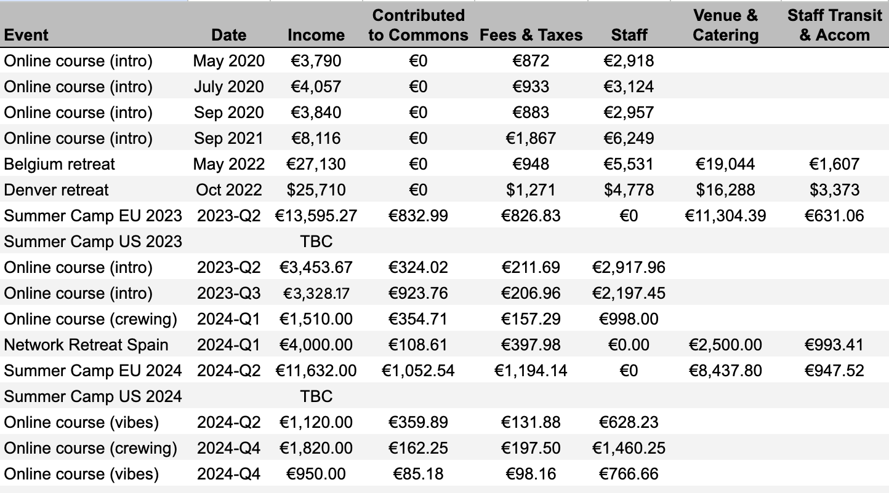

# Microsolidarity

In late 2018, Richard D. Bartlett published a [proposal](articles/proposal.md) to start a "microsolidarity" group — a small mutual aid community for people to do a kind of personal development, in good company, for social benefit.

Since then, an open research network has been gradually self-organising around this concept and these practices.

This website is the central hub to collect resources for the co-development of multiple such communities. The most useful material is currently here: [methods for cultivating Crews](crewing/) for peer-to-peer support in tiny groups.

For a thorough understanding of the project, read through [these articles](articles/) in sequence. If you prefer video, you can watch a quick [overview of the project here](https://www.youtube.com/watch?v=yWyZmmJCrSA&feature=youtu.be&t=869).

You can check out more recorded conversations on [this YouTube playlist](https://www.youtube.com/channel/UC6hicteAM1PrzfeWN5VT5dg/) or [this podcast feed](https://anchor.fm/microsolidarity) and be sure to [join the Loomio group](http://loomio.org/microsolidarity) if you want to connect with other practitioners. [Join Rich's newsletter](http://richdecibels.substack.com) for occasional updates on this project.

## Definition of terms

The proposal introduces some specific use of language:

**Microsolidarity** is a set of practices for mutual support between peers. These methods bring us out of individualism and into a more relational way of being.

Most of this support happens in a **Crew**: a small group up to about 8 people growing trust in each other through emotional & economic reciprocity. Crews are always designed for intimacy, and may also produce an output \(e.g. a software product or an activist campaign\).

The **Congregation** is a space for Crews to co-develop in the company of other Crews. Congregations have less than a few hundred people, so they can be primarily governed through trust and dialogue.

Many Congregations could form an **Assembly**.

_For more context on these definitions, read the original_ [_proposal_](articles/proposal.md)_._

## About this site

All the content on this site is published with a [CC-BY-SA](https://creativecommons.org/licenses/by-sa/4.0/) license. So please use it however you like without asking permission: just give credit, and use the same license for derivative works. Unless stated otherwise, assume the author is Richard D. Bartlett.

