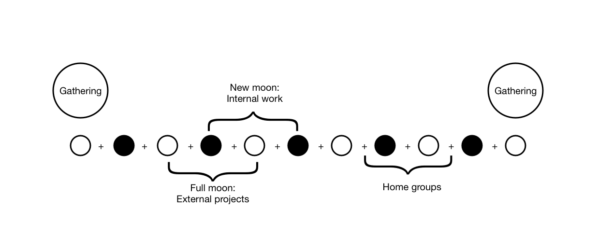

# \#3: Congregation Scaffolding

## People, Practices & Place

### A Simple Structure to Hold a New Microsolidarity Community

Last week I published the latest story in my [Microsolidarity](http://microsolidarity.cc) series, explaining [how to start a new mutual aid community](https://medium.com/enspiral-tales/how-to-weave-social-fabric-9385a841559f) \(a “Congregation”\). That chapter was exclusively focussed on the initiation process: where do you start?

For this chapter, I want to advance the clock a few months. Assume you’ve had one or two amazing gatherings, and there are 20 or 40 people ready to commit to supporting each other. What’s the minimum organisational structure needed to hold them together? I’m going to make a short sketch of a complete structure, as a first guess. The parts are all tried and tested, but I’ve never had a chance to launch a new community with this whole structure, so this is slightly speculative.

I think it is important for a community to be aligned at the abstract level: having shared values, principles and purposes. However, I don’t think it is very interesting to create that alignment _by talking about it_. Instead, the focus is on finding alignment by _doing stuff together_. So the essence of this proposal is to organise primarily around three concrete elements: a small group of **People**, doing periodic **Practices** in a defined **Place**.

For the sake of this article, assume that all the members of the Congregation are working in related fields towards some positive social change, e.g. activists, community organisers, and people working in NGOs and social enterprises. They have shared interest so they’re predisposed to collaborate, and they have enough shared context that they can support each other effectively in their personal and professional development.

### Periodic Practices

These are the rhythms that apply to **everyone**:

* There are **2 Gatherings per year**, coincident with the full moon. They’re the “main event” where we weave our connections, and the place where new potential members get to meet us. See [the previous article](https://medium.com/enspiral-tales/how-to-weave-social-fabric-9385a841559f) for more info about these gatherings.
* On the other **full moons** of the year, there’s a video call for members to connect and support each other in their **outward facing work** , e.g. we can use [Case Clinic](https://www.presencing.org/resource/tools/case-clinic-desc) or other peer-coaching methods where one member is helped by 3 or 4 peers.
* On the **new moons**, there’s a video call for anyone who is working to “hold the container”, i.e., taking responsibility for the organising structure. Sometimes we’d use this space for a deep dialogue, or a participatory process to include people in policy development; sometimes it would be more administrative/operational. This is the regular point of focus for **inward facing work**.
* We prioritise holding a **steady rhythm** to avoid losing energy in scheduling. Other meetings will happen off to the side, but these monthly pulses are the main focal points.
* Everyone is **expected to join** at least one gathering per year and all the calls are optional.
* **Sense-making** and **deliberation** is done on the calls or at the gatherings. Important **decisions** are finalised by consent on [Loomio](http://loomio.org).

### People

* We need at least **two categories of membership**, let’s call them Friends and Partners. \(This is a constructive way to deal with the [participation inequality](https://www.nngroup.com/articles/participation-inequality/) which affects all groups.\)
* **Partners** are members with more commitment and capacity for co-leadership, who are trusted and able to tend to the needs of the whole. We probably don’t need many Partners for the Congregation to function well, but there needs to be some longterm consistency.
* **Friends** get to participate as individuals and don’t have to think too much about the big picture unless they want to.
* Partners decide **who to invite** as Friends and who to invite as new Partners.
* The only way to join as a Friend is by **coming to a Gathering**. This ensures a critical mass of relationships as soon as they arrive. After the gathering they join our digital spaces and can participate as much or as little as they like.
* Friends **may be invited** to become a Partner at their second Gathering \(or later\), if they’re trusted and ready to take more responsibility for the whole. There’s no shame in being a Friend forever.
* Everyone should be in a **Home Group** \(aka [Pod](http://handbook.enspiral.com/guides/pods.html) or [Crew](https://www.microsolidarity.cc/crewing)\), 3-6 people meeting on a weekly/fortnightly or monthly pulse. You choose your own frequency and focus, usually some kind of peer-support in the professional or personal domain. Home Groups usually form during or shortly after Gatherings.
* Everyone may receive **support for their work**, e.g. in the Full Moon calls.
* Everyone is encouraged to share leads and **opportunities for working together**.
* Anyone can be in a temporary **Working Group** for doing internal work, e.g. hosting a gathering, developing a new policy.
* Everyone should make a **regular financial contribution** \(eg €10-50/mo\) so we can pay for internal work, e.g. writing the newsletter, hosting the calls and gatherings. Details here are very context-dependent. For many new collectives, it makes sense to start with [Open Collective](https://opencollective.com/) so you don’t need to invent a legal structure or deal with admin overhead.

### Place

The Congregation is designed for strong ties, so it is constrained to one Place. A Place might be as small as a village or as big as a continent. In my view, starting in too many Places is an anti-pattern: requires carbon-intensive travel; it’s hard to weave a density of relationship; and money/legal stuff gets complicated, etc.

In addition to the physical Place, we have virtual Places. These virtual places are a platform for self-organising, e.g. to coordinate work opportunities, learning, socialising, making offers and requests:

* An **instant messaging platform** \(e.g. Telegram, Slack, WhatsApp\) for **informal** chat, reminders, announcements, invitations etc. People are **not expected to keep up** with everything here.
* An **asynchronous discussion platform** \(e.g Loomio, Discourse\) for **long-lasting information**, e.g. collating shared resources, or finalising decisions.
* A **regular newsletter**: summarises activity and highlights any important calls to action. This is the only virtual place **everyone is expected to pay attention** to.

That’s it! That’s the whole structure. In 2020 I expect to implement something like these ideas in two of the Congregations I’m in, so this speculative sketch will be tested and refined then. I’ll keep updating the [microsolidarity website](http://microsolidarity.cc) as R&D progresses.

If you’re reading this and you’re feeling inspired to action, here are some things you can do:

* If you want to be **notified of updates**, [join my newsletter](https://richdecibels.substack.com/).
* If you want to **discuss Microsolidarity with others**, [join the Loomio group](https://www.loomio.org/d/xtAj8C6R/people-practices-place).
* If you want to **support my work** curating patterns of organisation that work across different contexts, you can [give me money on Patreon](https://www.patreon.com/richdecibels).
* If you want to **contact me**, please see the [guidance on my website](http://richdecibels.com/#contact), as I am frequently overwhelmed by interesting strangers :\)

p.s. This story is published by Richard D. Bartlett with no rights reserved. [My website has extra file formats](http://richdecibels.com/stories/people-practices-place) for easy reproduction.

