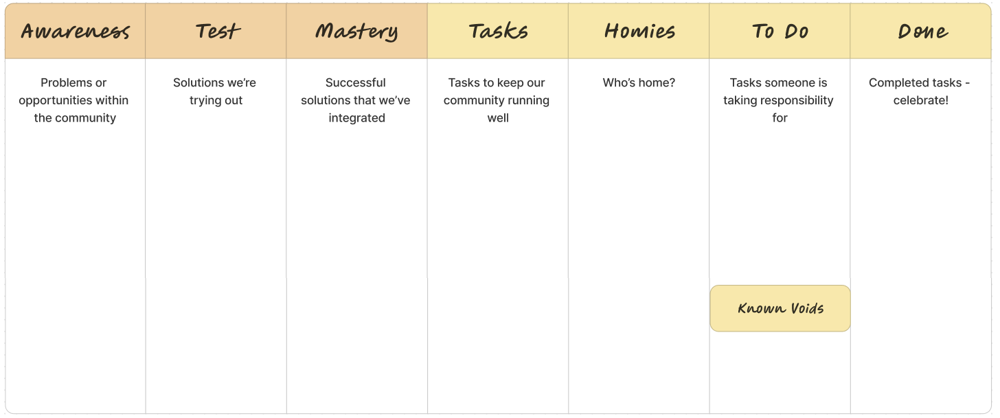

# Community Mastery Board

How do we want to be together?

_Adapted from_ [_my blog post here_](https://becomingtogether.net/2024/03/22/community-mastery/).

**The Community Mastery Board** is a tool for actively shaping your group’s culture and norms through regular iterative cycles of trial-and-error experiments. It’s been successfully used in classrooms (where it was initially developed), amongst work colleagues and co-residents.

It works by surfacing and visually tracking what’s working, what’s not, and what we’re doing about it. For groups who need to allocate tasks, it also makes sense to combine it with a Kanban Board to represent what tasks need doing, who’s going to do them, and celebrating who’s done it.

In this blog I’m going to share the principles behind this tool, and share an example of how I’ve used it for co-living Crews in the past.

Here’s how a typical Community Mastery & Kanban Board would look for a residential community:

One example of a Community Mastery – Kanban board

(yet to be populated by a rainbow of sticky notes)

**Awareness**

An Awareness is a problem or opportunity within the community. It may be a practical household related topic like "WiFi doesn’t work well when we’re all on Zoom calls", or “There’s a membership discount at the local organic grocery store if we register”, or something more personal or interpersonal like “I hear we all have our life challenges and I want to find ways to be more supportive of each other”.

I’ve found that framing an Awareness as a specific observation, like: "Noise from kitchen conversations travels through to bedrooms" makes for a more effective starting point than a more vague concern, such as “I’m not sleeping well here”.

**Test**

A Test is a strategy you’re going to try out to address the Awareness. A good Test is one that is easiest and quickest to implement and try out, not necessarily the ‘best’ one. If it doesn’t work, you can scrap it, change it or build upon it at the next meeting. The idea is to keep the group flexible and agile, finding solutions relevant to your group’s current needs and developing them as you go. This also reduces the risk of meeting ‘bore-out’ from spending lots of time nit-picking over ‘perfect’ solutions, and resistance against an overload of pre-emptive rules and structures to adhere to. I find it helpful to ask people "is this good enough for now and safe enough to try?".

**Mastery**

You can move a Test over to the Mastery column when it’s working and happening naturally enough that it’s become part of your community’s habitual culture. It’s integrated into how you do things without much need for reminders. Go you! Some people like to name this column ‘Agreements’ or ‘Rules’ instead. And if at some point they don’t work any more, you can always raise an Awareness about it!

_Now let’s look at the Kanban side of the board to get clear on who’s taking responsibility for what between now and the next meeting…_

**Tasks**

Tasks can be cyclical tasks which need doing on a regular basis, e.g. cooking dinner or cleaning the bathroom, or linear tasks that just need doing once, e.g. buying a slack-line for the garden or letting the neighbours know you’re going to have a party on Friday. You might add new Tasks as you run new Tests and evolve your way of being together. Tasks could also be roles like ‘Community Documentor’ or ‘Bell Ringer’ which you can rotate at every meeting.

**Homies**

This is a list of who’s at home (or in the class/office/studio/group) between now and the next meeting.

**To Do**

During each meeting, we go through which Tasks need to be done between now and the next meeting, and who is going to take responsibility for them. We stick Tasks in this column, just to the right of that person’s name in the _Homies_ list. If they realise later in the week that they can’t do that Task, they try to find someone else to do it instead, or put it in the Known Void box (read on below). When the Task has been completed, it can be moved to the Done column! Hoorah!

An important concept here is that people take on Tasks that they have capacity and enthusiasm for. If no one does (especially on a regular basis),

**Known Void**

If there are Tasks to be done but no one has the capacity or enthusiasm for them this cycle, we can put them in the Known Void box. It may be that someone feels like picking it up later in the week, but even if not, it’s helpful to know, for example, that no one is cooking for a shared meal on Thursday evening, so we each sort dinner out for ourselves on that day.

If a Task regularly ends up in the Known Void box you might consider raising this as an Awareness and finding a Test to find other ways to get this Task done. For example, bathroom cleaning has low uptake? Why not Test doing a collective cleaning party, or hiring a cleaner once in a while? Rather than overextending yourselves and becoming bitter trying to maintain a system that’s not aligned with your capacity or joy, look for other strategies to meet your needs. A successful sustainable community system is one that’s designed to adapt to the true capacity of the individuals in the group, not one that’s tied to crossing off a rigidly fixed checklist.

Photo by Janusz Ratecki, CAN RÓWNOWAŻNIA#2 workshop

**Done**

Celebration leads to Success! I like how the Done list makes visible and acknowledges what everyone has contributed towards the life of the community since the last meeting. I’ve often started my meetings off by reading through this list to rounds of applause and "yay!". It sets a great tone when you start a meeting by appreciating each other.

What if a Task didn’t get done? Obviously there will be some Tasks left on the ‘To Do’ list because they need more than one meeting cycle to complete. But as with the Known Voids, if there are Tasks which seem to linger around this list longer than expected, consider raising it as an Awareness. Do you want to Test out a different approach to this Task? How’s the person responsible for the Task doing? Do they need some help? Analyse the system before blaming the individual!

_Now let’s look at how to run your meetings…_

**Meeting Rhythm**

Going through the board together with everyone on a regular weekly or monthly basis is recommendable for a number of reasons:

* Short iterative learning and reflection cycles reduce the likelihood of a build up of large tensions.
* People are more open to trying out new ways of doing things if they know that there will be a dedicated moment in the near future to reflect, adjust or stop doing it altogether if it’s not working.
* Learning from regular smaller interventions which are either reversible, or have manageable levels of negative impact if they don’t work out, makes the need for larger riskier interventions less frequent and necessary.
* Addressing small tensions regularly together builds your collective capacity and courage to address larger ones when/if they arise. You’ll learn that tensions are opportunities for learning and exploring new possibilities for being together, not a sign that you’re failing or, at worst, "this is the end!"

So consider how often and for how long you want to meet each time. Your answer will probably depend on your group’s capacity and context. In urban co-living houses, we’ve often run 30-minute Community Mastery meetings on a weekly or biweekly cycle, usually after a communal dinner on a day we’re most likely to be home. In a 2-week co-living retreat we met after dinner 3 times a week as we wanted to build up a shared culture of trust and tension-transformation quickly within a short period of time.

**Facilitating the Meeting**

It’s helpful to have someone to facilitate the group through the meeting. Rotating the facilitator gives everyone a chance to practice hosting a short group process. Going through the board in the same way every time means people who are less familiar with facilitating will find it easier to emulate and step in. I’d suggest going through the meeting in this order:

1. Celebrate the ‘Done’ list!
2. Review Tests from the last cycle
   * Not working? -> Come up with a different Test to try out for the upcoming cycle
   * Working well? -> Keep testing it until it feels fully integrated
   * Has it become fully integrated? -> Move it to the Mastery list!
3. Invite new Awarenesses
   * Encourage the person bringing the Awareness to suggest a Test. If they don’t have one, it’s not a problem - they can ask the group for ideas.
   * Some groups like to invite people to populate this column before the meeting if they think it will save time and help people think of appropriate Tests.
   * Include any Tasks which have repeatedly ended up in the Known Voids box or repeatedly haven’t been done
4. For each new Awareness, come up with a Test for the upcoming cycle
   * Remember: you’re not looking for the perfect test, just one that’s good enough for now and safe enough to try
   * If there are objections to the Test, aim to clarify the concern, and ask the objector (or secondarily, the group) to suggest a new Test that addresses their concern(s)
   * Note: if a Test is difficult to agree upon, it may need more asynchronous reflection and dialogue between people who are particularly concerned by it. Don’t hesitate to ‘take the process offline’ if it doesn’t seem the right space for it or it’s going on too long.
5. Go through the Tasks for the upcoming cycle and allocate them to Homies in the To Do list
6. Put any of this cycle’s unclaimed Tasks in the Known Void box

* Jocelyn Endres
