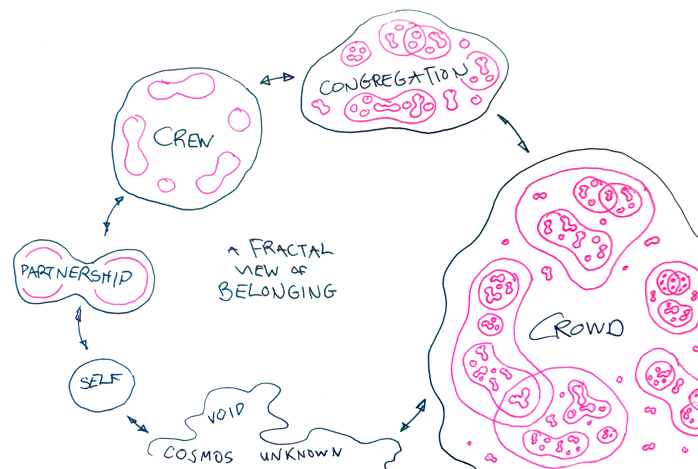
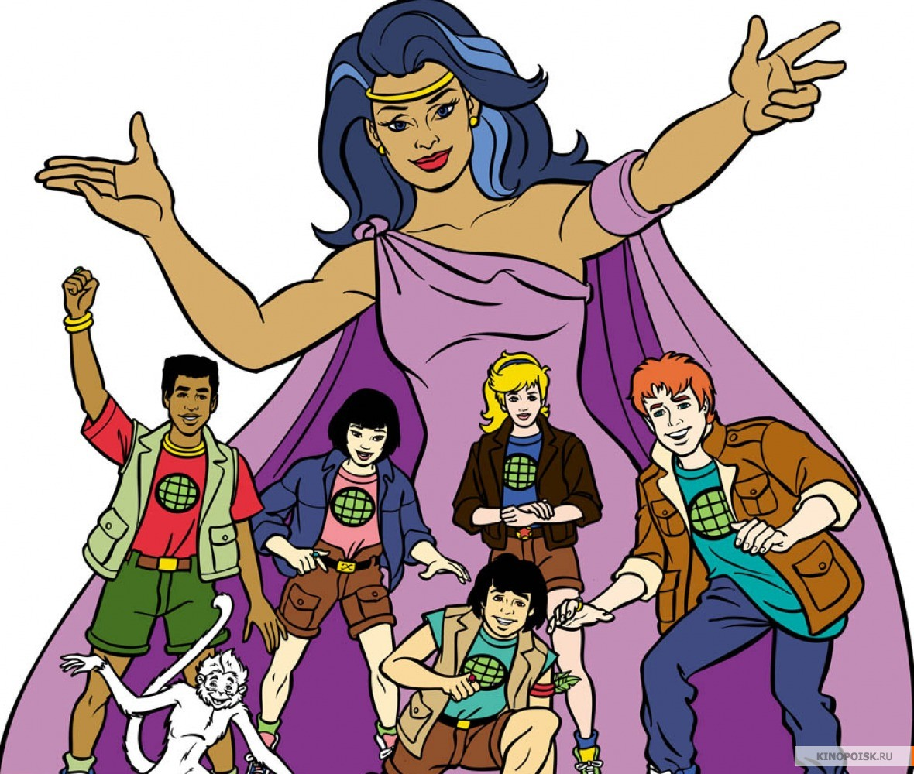

# #1: Proposal

## Courage Before Hope: A Proposal to Weave Emotional and Economic Microsolidarity

### Or: What To Do in the Last Decade of the Anthropocene

I’ve spent most of the past 2 years travelling with my partner Nati, trying to discover what is the most strategic & wise action to take in a world that seems to be accelerating towards collapse. After an enormous amount of consideration, I have a strategy that feels good enough to engage my will and commitment. This document is a statement of intention. All going well, it’s where I want to invest my productive energy for the next 7 years or so.

I’m developing this plan in three phases:

* Phase 1 is a lot of conversation and contemplation.&#x20;
* Phase 2 is this writing and re-writing process. Writing in public forces me to fill in the gaps in the argument, and to make my assumptions explicit.&#x20;
* Phase 3 is where you come in as a reader and collaborator. If you feel struck by this proposal, I’d love for you to improve my thinking with your feedback. The best possible response will be for other people to run related experiments in parallel.&#x20;

The proposal is very simple. But this is, I hope, the simplicity on [the far side of complexity](http://www.jonkolko.com/writingSimplicityComplexity.php). The design elements come from 7 years of thinking & doing in the [Loomio Cooperative](http://loomio.coop) and [Enspiral Network](http://whatis.enspiral.com).

I intend to start a new community as a sibling or cousin of Enspiral: about 30 to 200 **people supporting each other to do more meaningful work**. Our method will focus on getting people into “crews”, small groups of 3-8 people that start with emotional intimacy and get to economic intimacy. There’s a sequence from psychological safety to shared ownership of productive assets. The larger community functions mostly as a dating pool for people to find their crew-mates. The crews support the personal development of their members while doing useful things like providing housing, establishing circular-economy startups, growing food, making revolutionary art, or whatever activity seems meaningful to their members.

That’s the short version: form small groups, share feelings, then share money. In the following few thousand words I spell out the long version. I think modular and open source strategy is much more valuable than charismatic leadership, so I’m documenting my strategy as thoroughly and accessibly as I can. Because it is open source, you can copy it, modify it, and help me to spot bugs.

This article is long, so let’s start with a map:

* Part 1. I start by briefly setting context, giving a name to the metacrisis I believe is threatening society as we know it.&#x20;
* Part 2. Then there’s a chunky piece of theory to explain how I think about groups, and groups of groups.&#x20;
* Part 3. With that background established, I can spell out my “microsolidarity” proposal in more detail.&#x20;
* Part 4. Then we get to the counter-intuitive part. I’m intentionally contradicting a lot of received wisdom from progressive and radical politics, so I want to do that explicitly, in the hopes that we can learn from each other.

Okay, let’s go!

## Part 1. Collapse

I won’t spend a lot of time on this point because it is a downer, but it deserves a mention: we are well into a major collapse of our biological life support systems. Oops!

Just one data point: the population of wild animals on Earth has halved in my lifetime ([source](https://www.theguardian.com/environment/2018/oct/30/humanity-wiped-out-animals-since-1970-major-report-finds)). This is not new information, but we are mostly in denial. [Extinction Rebellion](https://rebellion.earth), a new climate action movement from the UK, remind us that we’ve known this [at least since 2006](https://www.theguardian.com/environment/2006/mar/21/conservationandendangeredspecies.internationalnews) when the United Nations (UN) warned us that “humans have provoked the worst spate of extinctions since the dinosaurs were wiped out 65 million years ago”. Yet our response is still piecemeal, uncoordinated and counter-productive.

While the biological substrate for life is disintegrating, so is our social fabric. Democratic populations are electing dictators and buffoons. Fascism is resurgent. Our ability to make meaning is dissolving. Across the political spectrum, people respond to this existential dread by retreating into anxious certainties. Political conversations feel brittle and explosive, one wrong word can trigger an artillery of shaming tactics to shut down the heresy.

This is how I set the design criteria: assuming we are in a major collapse, what is an appropriate action to take? How do we repair our damaged biological and social ecosystems? How do we plan for a future with much less peace, much less food, much less stable governance? What kind of action plan is fit for purpose in the last decade of the Anthropocene?

_See, I told you this section would be a downer. But I promise from this point on it’s all optimistic and constructive._ 👍

### Design criteria for action amid collapse

First criteria: **we need enormous courage to persist without a guarantee of a positive outcome.** Because I’m plugged into a renewable source of courage, I am a very hopeful optimistic confident person. _So where does courage come from?_

Second criteria: **we need resilient methods for** _**making meaning**_ **in the midst of chaos**. The shortcomings of the old institutional media and the new networked media are collaborating to produce a freak wave of collective insanity. The popular votes for Brexit, Trump, Boaty McBoatface and Bolsonaro all illustrate the magnificent failures of our sense-making apparatus.

Third criteria: **people with life-supporting values need to grow our power to influence the distribution of resources.** Just 100 individual CEO’s are responsible for 70% of the world’s greenhouse gas emissions ([source](https://www.theguardian.com/sustainable-business/2017/jul/10/100-fossil-fuel-companies-investors-responsible-71-global-emissions-cdp-study-climate-change)). The oligarchs are killing us. We need to get our hands on power of that magnitude, but it needs to be much more widely distributed and much more accountable.

So my humble proposal needs to produce limitless courage, make meaning from chaos, and grow enough power to counterbalance the suicidal oligarchs currently in charge. No big deal 😅

Finally, I believe that the core of this bio/socio/psycho/spiritual collapse is a metacrisis of **relationship**, it’s about _how I relate to_ the different parts of myself, to other people, and to all the other creatures, life, spirit, etc on this planet. If that’s true, then **my response must be relational first**. This article is written in the first person singular: it’s all I, I, I. That’s a stylistic choice for creative freedom. However, that language obscures the reality that all of this action is conducted in the first person _plural_: there is always a “we” acting together, me and others.

So that brings us to my theory of groups, which you can read in Microsolidarity Part 2: a Theory of Groups and Groups of Groups. //

## Microsolidarity Part 2: a Theory of Groups and Groups of Groups

### Definition of terms

For me to explain my theory, I need to invent some language. Unfortunately in English, we are missing words for different kinds of group. When I say “group of people” I could mean 3 people, or 300, or 3 million. These missing words are symptomatic of missing ideas.

So I’m going to propose some new words, to access new ideas. I’m not attached to the specific terms, and this is not a comprehensive map of all the different kinds of group, it’s just a subset of terms that will be useful for this argument.

#### 1: the Self

The first group has only one person, it’s Me (or You). In this article, when I say “Self” I’m thinking of a tight network of overlapping identities who share custody of this body we call Me. Viewing my Self this way invites me to treat all my parts as worthy of respect and compassion. We’re all lifetime members of the consciousness called Richard D. Bartlett, even the ones I try to disown and shut down.

_For more on this,_ [_Emmi’s article on consent and autonomy_](http://emotionalanarchism.com/widening-the-bridges-beyond-consent-and-autonomy-emmi/) _is a good introduction to the idea of a “networked self” and it’s implication for your relationships._

#### 2: the Dyad

A Dyad is a relationship of two. If you can forgive the tremendous oversimplification: let’s imagine society is an enormous Lego structure, but the only building blocks we have are Dyads. And now let’s say a Dyad can only be in one of two states: Domination or Partnership. Domination is imbalance, coercion, abuse, colonialism, the most controlling parent of the most acquiescent child. Partnership is like the balanced and consenting intimacy of two interdependent adults. Could also be a best friend, sibling, therapist, mentor, imaginary friend, spirit guide, etc. Because we learn so much through mimicry, an intentional Partnership Dyad is the best method I know for growth, healing, and development of the Self.

_If you want to follow this logic that **domination relationships are the root of all injustice, and partnership relationships are the root of all freedom**, here are some juicy links: check out ‘NO! Against Adult Supremacy’, an anthology of zines available_ [_online_](https://issuu.com/dogsectionpress/docs/no) _&_ [_in print_](https://dogsection.bigcartel.com/product/no-against-adult-supremacy)_;_ [_Transactional Analysis_](https://en.wikipedia.org/wiki/Transactional\_analysis) _is a therapeutic method for understanding interpersonal behaviour as parent-, child- or adult-like; and_ [_Aphro-ism_](http://aphro-ism.com) _is a Black vegan feminist argument that all oppression can be understood through the human-subhuman divide._

I reckon if the old domination society is finally disintegrating, let’s grow the next one around partnerships. I’m talking adult-to-adult, not parent-child relationships, from home to school to work to community to government. Are! 👏🏽 You! 👏🏽 With! 👏🏽 Me! 👏🏽

#### 3: the Crew

A Crew is a group that is small enough to fit around a single dinner table, around 3-8 people. This is about the same size as a nuclear family, but without the parent-child power dynamics. This is a long-term set of relationships with singular purpose, like a co-op, shared house, or affinity group. The size is important, because it is small enough to stay highly coordinated with minimal explicit rules & roles, and large enough that your enhanced impact is worth the cost of collaborating. If you observe many interactions in a Crew, you get many opportunities to learn about different ways of being a Self and being in a Partnership.

#### 4: the Congregation

There’s another crucial size somewhere between 30 and 200 people: small enough that most of the members can know each other’s name, big enough to support many Crews to coalesce. Coordinated impact at this scale requires some formal rules & roles, but mostly you can hold coherence just by putting a bit of extra effort into the relationships. In my experience the best way to find your Crew is to spend some time in a Congregation. Coordination gets a lot more complicated beyond this point.

If you use my language for a second, you can think of Enspiral as a Congregation of Crews. We fluctuate around 200 people, all supporting each other to do more meaningful work. We have a big annual gathering, a coworking space, a participatory budget, and many experiments in developing systems for mutual aid. Loomio is one of about 10 or 20 stable Crews in the network, each one focussed on a specific purpose, like [fixing the diversity problem in the tech sector](http://devacademy.co.nz), or [providing accounting services to social enterprises](https://fairground.co.nz/about-us/), or [building an intergalactic communications network](https://protozoa.nz).

The Crews and Congregation are in reciprocal co-development. I can absolutely say Loomio wouldn’t exist without Enspiral, _and_ Loomio’s success has made major contributions to the development of other Crews. So my proposal is to work at both of these scales simultaneously.

#### 5: the Crowd

There’s probably a couple more useful distinctions beyond 200 people, but for the purpose of this map, all human groups bigger than [Dunbar’s Number](http://www.theagileelephant.com/dunbars-numbers-and-organising-for-social-business/) get lumped into this one category: the Crowd. This includes corporations, neighbourhoods, regions, nations, multitudes, swarms, and many different kinds of networks, conferences, festivals, etc. All of these groups share some important characteristics. Only a minority of people can expect to be recognised in a Crowd. To develop and maintain trust, peace, coordination & coherence over time requires a lot of infrastructure: formal articulation of rules and roles, enforcement of norms, and checks and balances to ensure the just application of that enforcement.

### There’s an empty space between Self and Crowd

From where I’m standing, it looks like contemporary neoliberal urban westernised society is mostly designed for Selves and Crowds. There’s a little space for Dyads, and almost no room for Crews and Congregations.

Anywhere you look: government policy, media narratives, conferences, employee performance management, UX design, the healthcare system… in all these different fields you will usually hear people being treated as either **individuals** or **anonymous mass populations**. Check any story in today’s newspaper and you’ll see what I mean. Climate change will be fixed by “you recycling” or “government policy” or “a social movement”.

That’s what individualism looks like: the vast majority of our conversations are about individual people (you, me, a public figure, your boss or lover), or about very large groups (Americans, progressives, women, programmers), which are so populous that the individuals have lost their distinct identity. Individualism is a metaphysical virus that allows us to only see trees, never the forest. This virus leaves us poorly equipped to work in groups.

Over the past 7 years of working with people who are trying to make the world a safer, fairer, healthier place, I’ve concluded that membership in a good Crew is a critical success factor. People enmeshed in really great Crews are most resilient to the psychological cost of doing social change work, and therefore the most able to think and act strategically. It’s at this small scale that we decontaminate each other, recover from the individualist virus, and start to learn a new way of being together.

So this brings is the core of my experiment: **can we create the conditions for many excellent Crews to coalesce?**

Read all about it in Microsolidarity Part 3: The Reciprocity Game…

## Microsolidarity Part 3: The Reciprocity Game

_This is part 3 of a 4 part series about ‘microsolidarity’: a plan for people supporting each other to do more meaningful work. The other parts are here: 1, 2, 4_

### Crews: when they’re good they’re really very good

Around \~5-8 people is a sweet spot of high impact and low coordination cost. Our little Loomio co-op is one example: we've raised more than $1M in ethical financing and supported 1000s of groups to be more inclusive and more effective in their governance. This is a scale of impact that I cannot possibly have on my own.

A good Crew is not only super efficient. It can also be a potent site for personal development. In a Crew you can experience human difference as a resource, which is our best antidote to bigoted tribalism. It’s a place to practice multiple Partnerships simultaneously, a rich source of belonging, acceptance, recognition, and accountability, a place to start coming out of my traumatised patterns of behaviour. My Crew is where my values gain nuance and complexity. One example: I only learned the crucial distinction between _fairness_ and _sameness_ by practicing a tonne of collective decision making around money.

In my original design criteria I said I want to work in a way that produces **courage** and **meaning**. You begin to see how Crews play such an important role when you view courage and meaning as social phenomena.

Simply, I believe courage is developed when we \_en\_courage each other, with our enthusiastic listening, praising, challenging, cuddling, gazing, regarding, acknowledging and reminding. It’s a fucking \_dis\_couraging world out there! I need almost constant deposits of encouragement to maintain a positive balance in the courage account.

Meaning, too. I make sense of a phenomenon by considering how my peers respond to it. If I know them very well, and I know myself well, I can interpolate the meaning of an event from the scattered data of my peers’ reactions. My stable membership in a few Crews gives me great confidence in my ability to make sense of this chaotic world.

### Unfortunately, Crews are often dysfunctional

Because we’re infected with individualism, we lack the techniques, behaviours, language, beliefs, ideas, tools, and nuanced values required to thrive in multiplicity. As a result, many small groups suffer common ailments: mini dictatorship, hidden hierarchy, too much consensus, not enough consensus, toxic culture, unresolved conflict, repetitive trauma, equal power dogma… We can easily get stuck in the triangular domination patterns, or the circular design-by-committee patterns.

Nati and I have spent the past 2 years helping groups to recover from some of these dysfunctions. [I’m writing a book](https://leanpub.com/patterns-for-decentralised-organising/) of practical solutions for the common failure patterns of collaborative groups. Hopefully these **ideas** can help a little, but what’s needed most of all is **practice**.

I’m curious what happens when we start new groups, already inoculated against the most common strains of the individualism virus. So in 2019 I plan to start a bunch more Crews so I can learn how to start them well. Here’s the first draft of the experiment I intend to run. I’m already looking forward to coming back here in a year to discover which ideas were totally misguided. Yay, **practice**! 🏋🏾‍♀️

### A Sequence to Crystallise new Crews

The first step is to start a Congregation localised to one geographic region (I’m starting in Western Europe). Nati and I will invite about 20 or 30 trusted people to a first gathering where we can co-design the minimum viable structure to govern our community.

As a starting point I suggest our purpose could be something like “people supporting each other to do more meaningful work”. That is, peers mobilising our diverse strengths to look after our peers, not institutional, paternalistic, or condescending support. “Meaningful work” is intentionally subjective, inviting a complicated amalgam of different purposes: planting trees, raising kids, writing software; if it is truly meaningful to you, it’s probably worth doing. And “more” is ambiguous in a good way: maybe you need _more meaning_ in your work, or you’ve already found your meaningful work but you want _to do more of it_, or maybe you want to shift the whole global system of work to be more meaningful. All the options are good!

If the 20-30 people subsequently invite 1 or 2 more, we’ll have a first cohort of up to 90 people, which should be a big enough dating pool for complementary Crew-mates to find each other. Hopefully we can immediately launch a handful of new Crews and run many micro-experiments in parallel.

I suspect the first thing to do within a Crew is to establish [psychological safety](https://www.nytimes.com/2016/02/28/magazine/what-google-learned-from-its-quest-to-build-the-perfect-team.html), a space where all the parts of your networked Self are welcome to show up. From there, the job is just to respond to the needs in the group.

Most of the people we plan to invite have already got a sense of what work is most meaningful to them, but almost all of us are financially precarious. So I’m interested in moving quite rapidly from emotional intimacy to economics. An easy place to start would be to disrupt the money taboo and expose our financial parts to each other: how much income do you earn? Where does it come from? What lifestyle would support you to be at your best? How much does that cost? If you need to earn more, are there some creative new tactics you can try? If you already earn enough, are there opportunities for you to get the same money with less compromise in your values, or more freedom in your time, or with more social impact? If you have a surplus, what needs to be true for you to want to share it with your crewmates?

Personally I’m interested in building economic solidarity, because I think we can do more good when we’re in a position to be generous. But maybe the rest of the Congregation will have different priorities. Mostly I’m interested in experiments that produce deep deep trust.

### The Reciprocity Game

Building trust is not rocket science. It’s mostly about reciprocity i.e. building a track record of doing each other favours. Here are some versions of the reciprocity game I’ve tried. If you know some more, please share ‘em!

#### Level 1: Listening

Sit in a circle. One at a time, someone says something that is true for them right now, e.g. “I’m excited about x” or “I feel sad because Y”. All you have to do is pay attention, listen to each person in turn, then eventually you say something that is true for you. If everyone listens to everyone, congratulations, you all just earned 1 reciprocity point.

#### Level 2: Money

One person talks about (A) the work they do for money, and (B) the work that is most meaningful to them. Discuss together how they might bring A and B into closer alignment. Now, anyone can make a small gesture to help make this happen, e.g. share a new perspective, offer a design process or productivity improvement, make an introduction, encourage them to keep trying even though it is hard. If you offer something: hooray, 5 points for you. If you asked for something you need, hey! 5 points for you too! And BONUS! you both get an extra point for talking and listening with mutual respect and positive regard.

#### Level 3: Consistency

It’s pretty easy to do something nice one time and have a momentary surge of good feelings. If you really want to excel at the reciprocity game though, focus on consistency.

Either in a Partnership (2 people) or in a Crew (up to 8), practice meeting once a month (virtually or in person). **Reflect** on where you’ve been and **envision** where you might go next. (You can do this during or before the meeting.) Take turns to share your reflections.

Everyone gets 1 point for the first meeting, 3 for the second, and 5 points for every meeting after that. 5 points deducted for missing a meeting.

If you want a little more structure, here are some documented processes you can try:

* [Feelz Circle](http://emotionalanarchism.com/how-to-form-a-radical-feelz-circle/) (3 processes for sharing emotional care between friends/ comrades/ lovers)
* [Care Pod](https://microsolidarity.cc/crewing) (personal-and-professional development in small groups, a new practice in development at Enspiral, based on Intentional Change Theory)
* [Stewardship](https://loomio.coop/stewarding.html) (peer support system for Partnerships)
* [The Elephants](https://medium.com/things-ive-written/the-elephants-182870501589) (long term personal development for Crews)

#### Level 4: Conflict

Now we’re getting into the harder levels. Conflict is a great way to strengthen ties. It goes like this: you do something thoughtless, or miscommunicate in a way that upsets somebody you care about. They get hurt. Then you apologise, take responsibility, and attempt to make amends. They listen and forgive. Woohoo! You transformed your conflict into greater connection: 10 reciprocity points each! Careful with this one though, because you lose 20 points each if you don’t find a mutually agreeable resolution.

#### Level 5: Co-owners

After you’ve played a few rounds of the earlier levels, you might be ready to play Co-owners. Start with an idea, maybe it’s a new tech platform or a community project or a commune. Maybe it’s a [savings pool](https://livingeconomies.nz/solutions/savings-pools) or [lending circle](https://missionassetfund.org/lending-circles/) or [livelihood pod](http://wiki.p2pfoundation.net/Livelihood\_Pods) for sharing credit, income or savings with your trusted peers. Whatever the idea, find some people who want to work on it with you. Now, when you formally incorporate as a company or an association or co-op, whatever, **share the legal ownership with a few people**. Congratulations, 100 reciprocity points! Whatever happens, this relationship is going to form a part of your life story.

Okay that is all fun and cool and optimistic, but if you’re reading with a critical eye you’ll notice that there are some parts of this proposal that run against the grain of a lot of progressive and radical thinking about social change. In the next part of this article, I’ll name some of the ways this recipe is unorthodox. Then y’all can help me discover if I’m the good kind of heretic, or the very very bad kind. 👹

On to Part 4. An Unorthodox Recipe For Social Change…

## Microsolidarity Part 4. An Unorthodox Recipe For Social Change

There are many components of the microsolidarity proposal that are out of step with the prevailing currents of progressive and radical thought. I’ll name five of those attributes here. I intend to acknowledge the risk of travelling _off piste_, and start the process of building accountability. This is a very exposing piece of writing, so please assume positive intent and check in with me if something triggers you.

### 1. Exclusivity

One of the most striking counter-intuitive parts about the microsolidarity proposal is that, if you’re reading this and we don’t know each other personally, _you’re not invited_. I invite you to start your own Congregation, but you’re not invited to join mine. That’s a bit shocking, eh! 😨

Most progressive social change actions start with inclusion as one of the top priorities. For this action though, we’re prioritising trust far ahead of inclusion. Actually there could be two barriers to inclusion: first to join the Congregation, then an even higher threshold to join a Crew.

I want to look around the circle at our first gathering and see 20 or 30 people with a specific set of traits. I’m thinking of people _I can count on_ to contribute to the psychological safety of others, people with high emotional intelligence and good boundaries. We’re going into experimental and challenging territory, so folks need to be extra-tolerant, open to different ways of knowing, being and doing. My people know how to DIY (Do It Yourself) and DIWO ([Do It With Others](http://archive.furtherfield.org/projects/diwo-do-it-others-resource)). We call each other to develop the highest parts of our Selves and to embrace our incomplete parts.

All of this exclusion is necessarily going to select for people with specific privileges, so it’s not a comprehensive plan to erase oppression and injustice in the world. Our collective has many responsibilities to the commons, beyond our own artificial borders. It’s critical that we use our increased resilience, resources, and opportunities to serve the needs of people outside of our tight circle. As a minimal gesture, I commit to continue doing the work of documentation, translating everything I learn into terms that make sense for people outside of my context.

But I’ve learned from long exhausting experience that there is no such thing as complete inclusion: the more permissive your entry criteria, the more you include people whose behaviour excludes others. So the question is not “should we exclude people?” but “which people should we exclude?”

### 2. Not for profit but with profit

Here’s another zinger: we’re going to deal with money, so that means we’re going to have to deal with people’s money traumas. I’m hoping Tom Nixon can join us at least in the early days, to help us [renegotiate our relationships with money](https://medium.com/the-happy-startup-school/millionaires-and-the-surprising-truth-about-their-money-worries-29ba02fafc85).

Most of us are _clenched_ when it comes to money, because of the stories and experiences attached to it. This seems to be especially true of people who are committed to making positive social impact with their work (_me, for instance_). We see the harm done by wealth inequality and corruption, so we conflate the wealth with the inequality. Anticapitalists conflate the marketplace with capitalism. We treat money as if it were dirty: I handle cash with my left hand while my right hand pinches my nose shut against the dreadful smell. It’s as if money is a pernicious acid that is just waiting to dissolve my values. Taboos prevent us talking about it, asking for what we need, and offering to help when we can.

I’ve tried being broke, and I’ve tried having enough to be generous, and I know which one is better for the planet.

When I was 21, after reading _Small Is Beautiful_, E.F. Schumacher’s powerful short book on meaningful work, I immediately wrote a blog post [publicly declaring my rejection of bullshit jobs](https://hayray.blogspot.com/2005/08/following-is-work-in-progress.html) (_if you follow that link, pls don’t read anything else on that blog because it’s super embarrassing_ 😅). I didn’t grow up with easy access to capital, so it took another 7 or 8 years before I started to earn a minimal wage on my own terms. (_Note: this is not a “bootstraps” story though, as I certainly did enjoy the privilege of New Zealand’s social welfare system to pay my rent when I couldn’t._) Now I’ve co-founded two small worker-owned businesses which pay me to do my most meaningful work ([Loomio](http://loomio.org) & [The Hum](http://thehum.org)), and pay to taxes so the state can do things like running the social welfare system.

These companies are not built _for profit_, but _with profit_. Generating our own income means we have the freedom to chart our own course. I think it takes money to do something ambitious, and it takes freedom to do something radical. So I want to be in community with people who are growing their financial resilience and co-investing in each others’ commons-building companies. I know the marketplace can be distasteful, but the situation is urgent, we need to be super effective.

### 3. Do Better Than Good

A lot of political strategy aims to change people’s behaviour because it is the right thing to do. If you want to be a “good” person, you’ll recycle, give to charity, and stop saying sexist things.

I’m more interested in strategies that can outcompete the “bad” option. I’m a feminist not because it’s the “good” thing to do, but because my quality of life improves as my relationships come out of patriarchal patterns. I absolutely believe we’ll all be better off without patriarchy, it’s not a tradeoff between winners and losers.

So I propose to outcompete individualistic consumerism with microsolidarity. I mean, how hard can it be to do a better job of meeting people’s psychological and material needs than this shitty 21st century gig economy? How many people have I met in the past few years who lack meaning and stability in their work, or who lack a sense of belonging? That’s our opportunity! Belonging is not a binary, like “yes” you’re connected or “no” you’re isolated. Belonging is a fractal: I have distinct needs for connection at each scale, from my Self, to my Partnerships, up to my Crew, Congregation and beyond. So do like the [Emotional Anarchists](http://emotionalanarchism.com) do, and find freedom in the interpersonal.

### 4. Decentralised governance with not a blockchain in sight.

['Nuff said.](https://medium.com/enspiral-tales/blockchain-doesnt-decentralise-power-5918c168e6f6)

### 5. Design for smallness.

In a world obsessed with big and fast, I’m designing for **small** and **slow**.

If our Congregation gets much bigger than 100 people, it’ll be time to start thinking about how to split in two. I’m starting “an independent sibling” of Enspiral rather than growing Enspiral to include more people, because I think the size is a critical success factor. I expect to be in this project for years before we see great returns.

In the past few years I’ve learned another important reason why “small is beautiful”, beyond what Schumacher wrote: our intimate peer-to-peer relationships have an extraordinary capacity for ambiguity and complexity. A high trust group can be very coherent and effective even with very low levels of **explicit** agreement about our state, direction and norms. It’s impossible to maintain this level of trust and connection beyond one or two hundred people. As organisations grow in size, they are governed less by interpersonal relationships and more by formal written policies, procedures, and explicit agreements. The written word is intolerant of ambiguity, and can only ever capture a tiny subset of reality, so groups that are governed by text are much less able to cope with complexity.

If you want to be agile and adaptive in a complex and rapidly changing environment, you **must** move as much decision-making power as possible into groups that are small enough to be governed by spoken dialogue, not written policy.

(For more on this theme, see my article [The Vibes Theory of Organisational Design](https://medium.com/enspiral-tales/the-vibes-theory-of-organisational-design-937a73f791cd). If you want to go deep into the difference between written and spoken records see also Walter Ong’s _Orality and Literacy_. For case studies demonstrating the relationship between performance and small-scale autonomy across many different industries, see _Reinventing Organisations_ by Frederic Laloux and _Team of Teams_ by General Stanley McChrystal.)

Ok, there are a bunch of other reasons why the microsolidarity proposal could cause alarm, but I’m feeling sufficiently exposed now so I’m ready to see what I learn from pressing “publish”. One last thought before I do:

### The Assembly of Congregations: A Decentralised Autonomous U.N.?

For now I’m going to stay focussed on starting this 2nd Congregation, but it’s fun to imagine what might happen at the next order of magnitude. Here’s a fun metaphor, which I gratefully borrow from my Enspiral-mate Ants Cabraal, after he shared it on [Douglas Rushkoff’s Team Human podcast](https://teamhuman.fm/episodes/ep-110-enspiral-better-work-together/):

The United Nations (U.N.) is currently our best effort at global governance. There’s 190-something nation states chipping in to fund a staff of about 40,000 people trying to make the world safer and fairer. Imagine if we mobilised another 40,000 people to work on global challenges, but instead of the traditional centralised organisational structure of the U.N., with its hierarchies, department and managers, imagine if we were organised in small, decentralised, self-managing, commons-oriented, future-proof, complexity-capable networks. After all, 40,000 people is just 200 Congregations of 200…

Are! 👏🏽 You! 👏🏽 With! 👏🏽 Me! 👏🏽

### Postscript

It’s been a couple days since I finished this major writing effort. For a moment I felt ecstatic: one part of my Self enthusiastically congratulating the other parts of my Self for being so confident, articulate and clever. But before I got a chance to publish, some of my other parts started speaking up. My confidence disintegrated as I listened to the voices of my uncertain, disoriented and timid Selves. They’re quick to point out that this essay is far too _X_ or it’s not nearly _Y_ enough. I think I’ve reached the limit of how long I can hold a monologue before I reconnect with my crewmates, check in, and add their sensemaking to mine. So I’m looking forward to improving this proposal with the thoughtful consideration and spirited dissent of my peers. Time to leap and trust the net will appear.

I’ll keep documenting what I learn along the way. Follow the #microsolidarity hashtag if you want to stay up to date, and [support my Patreon](http://patreon.com/richdecibels) if you want to free up more of my time for writing like this.

_This story is published by Richard D. Bartlett with no rights reserved: do what you like with the text. You can find it in many file formats_ [_on my website_](http://richdecibels.com/stories/courage-before-hope/)_._
