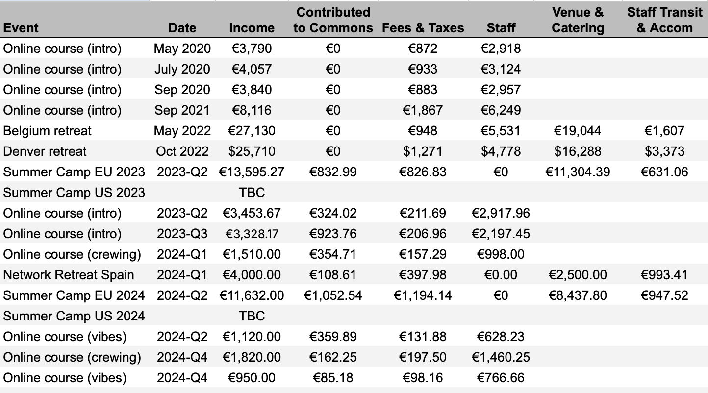

# EU Summer Camp 2023

_Microsolidarity is a community-building practice. We're weaving the social fabric that underpins shared infrastructure. Come practice with us!_&#x20;

<figure><figcaption></figcaption></figure>

It’s been a year since the microsolidarity network had an [in-person gathering in Europe](https://www.youtube.com/watch?v=u-mgfPm6hsg). Time to have another one! Between 18 - 23 July, we will come together for a week of community-building geekery, relaxation, peer learning, meeting old and new friends, and other kinds of meaningful fun.&#x20;

In the spirit of microsolidarity, the purpose of this event is for the network to come together, cultivate relationships of trust, cross-pollinate across different communities and practice meaningful co-creation. So whether you are a seasoned microsolidaritarian or just becoming familiar with what we’re up to - we’d love to have you!&#x20;

### 👉 [Register here](https://opencollective.com/microsolidarity/events/microsolidarity-summer-camp-eu-74950d99)

## What to expect&#x20;

* Hands-on experience of the principles, practices and vibe of microsolidarity&#x20;
* Lots of opportunities to learn from peers and contribute your own wisdom
* An empowering environment to exercise your agency for the common good

\
The hosting team (Jocelyn Ames, Uta Sievers, Richard D. Bartlett, Jonas Gröner, and Dan Lewis) are taking care of logistics and will set up some minimum-viable structures, like a collective opening and closing. The rest of our time will be powered by the contributions from all of us, through the magic of a co-created [open-space agenda](https://en.wikipedia.org/wiki/Open\_Space\_Technology).

<figure><figcaption></figcaption></figure>

To facilitate all of this juicy goodness in the most accessible way possible there will be two entry points to the gathering:\

* If you want the full blast of microsolidarity vibes, you can join us for the whole week, starting on Tuesday, July 18th until Sunday. The week will be hosted open-space-style with more of a relaxed summer camp vibe. In a way, this will be a lab for what real life in a microsolidarity community can be like.
* If you are short on time or are not quite sure if you want to commit to spending a whole week with a big group of people, you can join us just for the weekend, starting in the evening of Friday, July 21st.

**What not to expect**

This is not going to be a training, nor a curated experience. There might be some skill-share sessions or workshops on microsolidarity or related frameworks on the open-space agenda. This depends entirely on who shows up and what they want to offer.&#x20;

If you are just getting familiar with microsolidarity, we recommend you participate in the [4-session practice program](https://www.microsolidarity.cc/practice-program) that we run in June. There, you will get a chance to familiarise yourself with the principles and practices behind microsolidarity and catch a first whiff of the vibe.&#x20;

You can read more about the principles and practices of microsolidarity [here](https://www.microsolidarity.cc/).

<figure><figcaption></figcaption></figure>

## Venue & Accommodation

We will be staying at [Coconat](https://coconat-space.com/), a creative community and retreat venue just outside Berlin. True to the name of this gathering, please bring a tent or a camper van. There will be a freshly mowed paddock made ready for us to build our camp. The ticket price includes camping accommodation (i.e. in your own tent or van) and campers can book their entire stay through us.

If you want to rent camping equipment, or you want to stay in a bed, you can book that through the [Coconat website](https://coconat-space.com/inquiry/), which will incur extra costs on top of your entry ticket (paid directly to Coconat: please mention Microsolidarity in the text field).

<figure><figcaption></figcaption></figure>

## Food

In an effort to keep costs low, we’ll be cooking for ourselves. This means we’ll need a handful of volunteers to help out for a few hours in the kitchen every day. The hosting team will take care of shopping and coming up with a menu plan. Huge thanks to Dan Lewis who has volunteered to coordinate the kitchen!

\

<figure><figcaption></figcaption></figure>

## Children

We welcome families with kids! We haven’t yet planned out a childcare system, but we trust that together we can get creative with ways to ensure that parents can take part in sessions and their kids are happily well cared for in the meantime. Young people are welcome as full participants.

## Tickets

It is our goal to make this event as accessible as possible while also covering expenses for food and renting the venue. So we have made the following “small, medium and large” price tiers available: \

* S: 300 € (whole week) / 150 € (weekend)  - if it’s a stretch for you to be investing in this event at the moment, please choose this tier
* M: 400 € / 200 € - if you are financially stable and don’t have to think too much about whether you can afford this event, please choose this tier
* L: 500 € / 300 € - if you are financially flourishing, you have the opportunity to contribute to our scholarship fund and enable people with fewer resources to also attend

### 👉 [Register here](https://opencollective.com/microsolidarity/events/microsolidarity-summer-camp-eu-74950d99)

#### Kids

0-6-year-olds can attend for free, under 14 years kids are priced at 50% off the lowest tier, i.e. €150 for the week, €75 for the weekend.

#### Deposit

If you know you’re coming but you’re not ready to pay immediately, you can pay a €50 non-refundable deposit to guarantee your spot. You will see the option to buy a deposit on the ticketing page.

The rest of the ticket price is to be paid within 3 weeks of the event (by June 27). You can make this payment using the “flexible contribution” option on the ticket page.

#### Scholarships

If none of these tiers are accessible to you but you feel like you’d really benefit from coming, please [reach out through this form](https://docs.google.com/forms/d/e/1FAIpQLSd0U4lOD-gkhSqnn3y41Fic8xkfQRtnOQfm3MDckOgl4BSYfg/viewform?usp=sf\_link). Depending on how many people pay a higher ticket price, we can offer additionally discounted tickets or full scholarships.

### Financial transparency

Income from ticket sales will be used to cover venue rental and food. The hosting team is donating their time, so we’ll also use ticket income to cover their expenses. Any surplus that is left after the event will go towards the microsolidarity commons fund on [Open Collective](https://opencollective.com/microsolidarity), building a pool of funds to develop the network and organise future events like this one.&#x20;

### 👉 [Register here](https://opencollective.com/microsolidarity/events/microsolidarity-summer-camp-eu-74950d99)

###

## Not in the EU?

There will be a gathering happening in the US July 15th - 21st with a similar concept. You can check out details [here](https://dandelion.earth/events/6441dc5e443b170002452172).

## Any Questions?

Contact utasievers@gmail.com and she'll be happy to help :)

<figure><figcaption></figcaption></figure>

\

\
\
